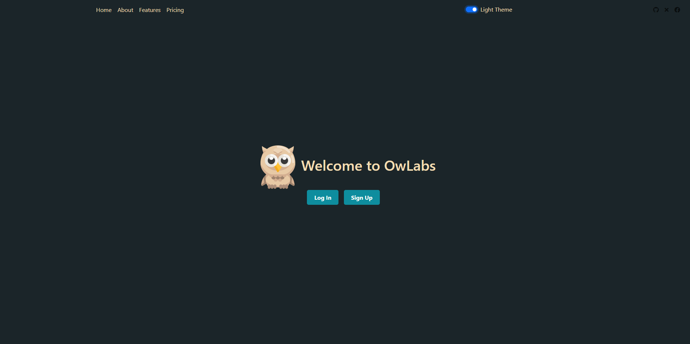

    <h1>Task Management App 📌</h1>
    
A web-based application to master your tasks, to-do lists, and priorities. Boost your productivity and collaboration!

    

---

## ✨ Key Features

- **Task Creation and Organization:** Effortlessly create, categorize, and prioritize tasks. Keep your responsibilities structured and clear.

- **User-Friendly Dashboard:** Your personalized dashboard offers a comprehensive overview. Filter tasks by category, priority, or status for quick decisions.

- **Real-Time Updates:** Experience seamless real-time updates via WebSockets. Collaborate effectively with live changes, no page refresh needed.

- **User Authentication and Security:** Register, log in, and manage your account securely. Your task data remains private and accessible only to you.

- **Task Notifications:** Stay on track with timely reminders for upcoming due dates and important tasks.

- **Collaboration and Sharing:** Share tasks and to-do lists with colleagues, friends, or family. Achieve your goals together.

- **Responsive Design:** Access the app seamlessly across devices. Desktop, tablet, or smartphone – the app adapts to your needs.

---

## 🚀 Why Choose the Task Management App

- **Simplicity:** User-friendly interface for everyone, from novices to task management pros.

- **Customization:** Tailor the app with customizable categories, priorities, and profiles.

- **Efficiency:** Optimize your workflow by effectively organizing and managing tasks.

- **Collaboration:** Enhance teamwork and communication by sharing tasks and collaborating in real time.

---

    Whether you're a student juggling assignments, a professional managing work tasks, or an individual striving for personal organization, the Task Management App is your ultimate companion for efficient task management.

